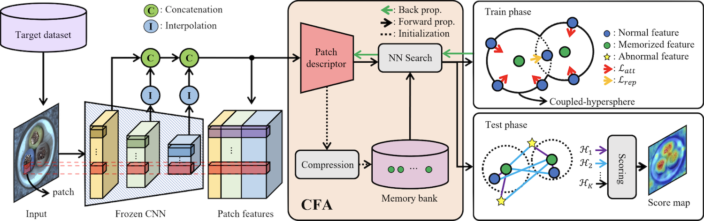
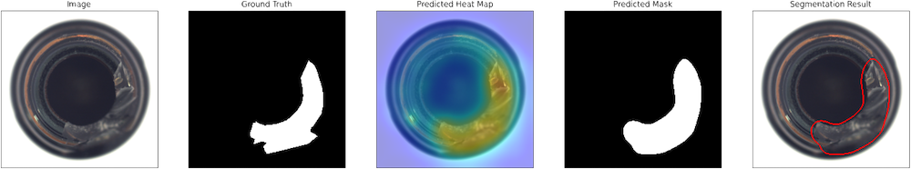
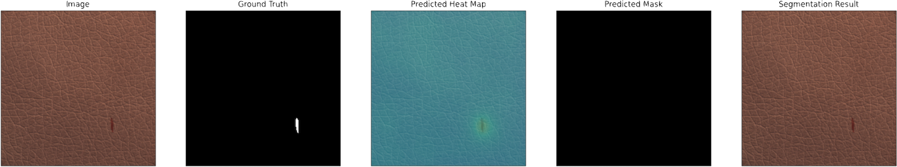
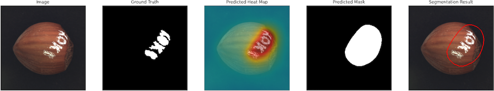

# CFA: Coupled-hypersphere-based Feature Adaptation for Target-Oriented Anomaly Localization

[](https://paperswithcode.com/sota/anomaly-detection-on-mvtec-ad?p=cfa-coupled-hypersphere-based-feature)

This is the implementation of the [CFA](https://arxiv.org/abs/2206.04325) paper. The original implementation could be found [sungwool/cfa_for_anomaly_localization](https://github.com/sungwool/cfa_for_anomaly_localization).

Model Type: Segmentation

## Description

Coupled-hypersphere-based Feature Adaptation (CFA) localizes anomalies using features adapted to the target dataset. CFA consists of (1) a learnable patch descriptor that learns and embeds target-oriented features and (2) a scalable memory bank independent of the size of the target dataset. By applying a patch descriptor and memory bank to a pretrained CNN, CFA also employs transfer learning to increase the normal feature density so that abnormal features can be easily distinguished.

## Architecture



## Usage

`python tools/train.py --model cfa`

## Benchmark

All results gathered with seed `0`.

## [MVTec AD Dataset](https://www.mvtec.com/company/research/datasets/mvtec-ad)

---

### NOTE

When the numbers are produced, early stopping callback (patience: 5) is used. It might be possible to achieve higher-metrics by increasing the patience.

---

### Image-Level AUC

|            | ResNet-18 | Wide ResNet50 |
| ---------- | :-------: | :-----------: |
| Bottle     |   0.991   |     0.998     |
| Cable      |   0.947   |     0.979     |
| Capsule    |   0.858   |     0.872     |
| Carpet     |   0.953   |     0.978     |
| Grid       |   0.947   |     0.961     |
| Hazelnut   |   0.995   |     1.000     |
| Leather    |   0.999   |     0.990     |
| Metal_nut  |   0.932   |     0.995     |
| Pill       |   0.887   |     0.946     |
| Screw      |   0.625   |     0.703     |
| Tile       |   1.000   |     0.999     |
| Toothbrush |   0.994   |     1.000     |
| Transistor |   0.895   |     0.957     |
| Wood       |   1.000   |     0.994     |
| Zipper     |   0.919   |     0.967     |
| Average    |   0.930   |     0.956     |

### Image F1 Score

|            | ResNet-18 | Wide ResNet50 |
| ---------- | :-------: | :-----------: |
| Bottle     |   0.983   |     0.984     |
| Cable      |   0.907   |     0.962     |
| Capsule    |   0.938   |     0.946     |
| Carpet     |   0.956   |     0.961     |
| Grid       |   0.946   |     0.957     |
| Hazelnut   |   0.996   |     1.000     |
| Leather    |   0.995   |     0.973     |
| Metal_nut  |   0.958   |     0.984     |
| Pill       |   0.920   |     0.952     |
| Screw      |   0.858   |     0.855     |
| Tile       |   1.000   |     0.994     |
| Toothbrush |   0.984   |     1.000     |
| Transistor |   0.795   |     0.907     |
| Wood       |   1.000   |     0.983     |
| Zipper     |   0.949   |     0.975     |
| Average    |   0.946   |     0.962     |

### Pixel-Level AUC

|            | ResNet-18 | Wide ResNet50 |
| ---------- | :-------: | :-----------: |
| Bottle     |   0.986   |     0.989     |
| Cable      |   0.984   |     0.988     |
| Capsule    |   0.987   |     0.989     |
| Carpet     |   0.970   |     0.980     |
| Grid       |   0.973   |     0.954     |
| Hazelnut   |   0.987   |     0.985     |
| Leather    |   0.992   |     0.989     |
| Metal_nut  |   0.981   |     0.992     |
| Pill       |   0.981   |     0.988     |
| Screw      |   0.973   |     0.979     |
| Tile       |   0.978   |     0.985     |
| Toothbrush |   0.990   |     0.991     |
| Transistor |   0.964   |     0.977     |
| Wood       |   0.964   |     0.974     |
| Zipper     |   0.978   |     0.990     |
| Average    |   0.979   |     0.983     |

### Pixel-Level AUPRO

|            | ResNet-18 | Wide ResNet50 |
| ---------- | :-------: | :-----------: |
| Bottle     |   0.940   |     0.947     |
| Cable      |   0.902   |     0.940     |
| Capsule    |   0.946   |     0.939     |
| Carpet     |   0.910   |     0.919     |
| Grid       |   0.911   |     0.862     |
| Hazelnut   |   0.931   |     0.930     |
| Leather    |   0.974   |     0.955     |
| Metal_nut  |   0.912   |     0.931     |
| Pill       |   0.935   |     0.947     |
| Screw      |   0.884   |     0.906     |
| Tile       |   0.892   |     0.906     |
| Toothbrush |   0.895   |     0.899     |
| Transistor |   0.895   |     0.930     |
| Wood       |   0.898   |     0.893     |
| Zipper     |   0.925   |     0.958     |
| Average    |   0.917   |     0.924     |

### Pixel F1 Score

|            | ResNet-18 | Wide ResNet50 |
| ---------- | :-------: | :-----------: |
| Bottle     |   0.751   |     0.789     |
| Cable      |   0.661   |     0.674     |
| Capsule    |   0.507   |     0.500     |
| Carpet     |   0.549   |     0.578     |
| Grid       |   0.316   |     0.280     |
| Hazelnut   |   0.598   |     0.561     |
| Leather    |   0.461   |     0.378     |
| Metal_nut  |   0.819   |     0.874     |
| Pill       |   0.689   |     0.679     |
| Screw      |   0.212   |     0.301     |
| Tile       |   0.740   |     0.768     |
| Toothbrush |   0.609   |     0.627     |
| Transistor |   0.570   |     0.666     |
| Wood       |   0.564   |     0.627     |
| Zipper     |   0.561   |     0.668     |
| Average    |   0.574   |     0.598     |

### Sample Results







## Reference

[1] <https://github.com/sungwool/cfa_for_anomaly_localization>

## Citation

```tex
@article{lee2022cfa,
  title={CFA: Coupled-hypersphere-based Feature Adaptation for Target-Oriented Anomaly Localization},
  author={Lee, Sungwook and Lee, Seunghyun and Song, Byung Cheol},
  journal={arXiv preprint arXiv:2206.04325},
  year={2022}
}
```
