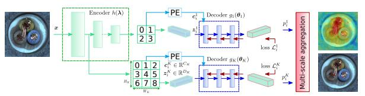
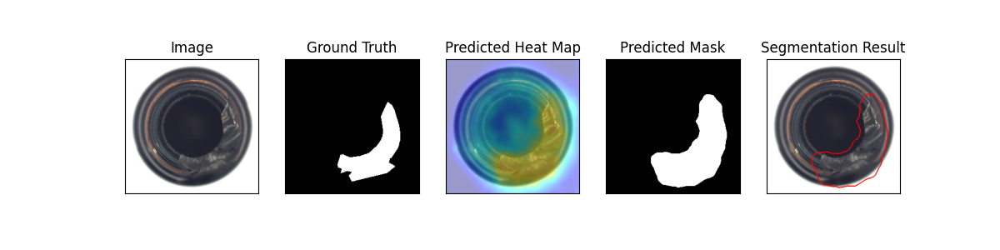
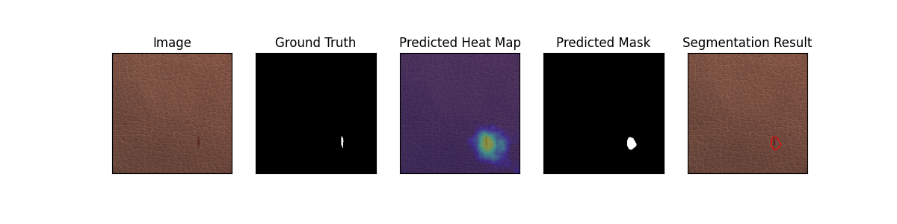
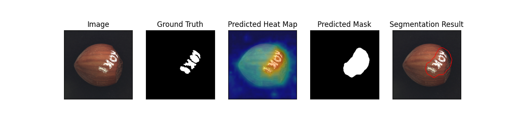

# Real-Time  Unsupervised Anomaly Detection via Conditional Normalizing Flows

This is the implementation of the [CFLOW-AD](https://arxiv.org/pdf/2107.12571v1.pdf) paper.

Model Type: Segmentation

## Description

CFLOW model is based on a conditional normalizing flow framework adopted for anomaly detection with localization. It consists of a discriminatively pretrained encoder followed by a multi-scale generative decoders. The encoder extracts features with multi-scale pyramid pooling to capture both global and local semantic information with the growing from top to bottom receptive fields. Pooled features are processed by a set of decoders to explicitly estimate likelihood of the encoded features. The estimated multi-scale likelyhoods are upsampled to input size and added up to produce the anomaly map.

## Architecture

## Usage

`python tools/train.py --model cflow`

## Benchmark

All results gathered with seed `42`.

## [MVTec Dataset](https://www.mvtec.com/company/research/datasets/mvtec-ad)

### Image-Level AUC

|                |  Avg  | Carpet | Grid  | Leather | Tile  | Wood  | Bottle | Cable | Capsule | Hazelnut | Metal Nut | Pill  | Screw | Toothbrush | Transistor | Zipper |
| -------------- | :---: | :----: | :---: | :-----: | :---: | :---: | :----: | :---: | :-----: | :------: | :-------: | :---: | :---: | :--------: | :--------: | :----: |
| Wide ResNet-50 | 0.962 | 0.986  | 0.962 |   1.0   | 0.999 | 0.993 |   1.0  | 0.893 |  0.945  |   1.0    |   0.995   | 0.924 | 0.908 |   0.897    |   0.943    | 0.984  |

### Pixel-Level AUC

|                |  Avg  | Carpet | Grid  | Leather | Tile  | Wood  | Bottle | Cable | Capsule | Hazelnut | Metal Nut | Pill  | Screw | Toothbrush | Transistor | Zipper |
| -------------- | :---: | :----: | :---: | :-----: | :---: | :---: | :----: | :---: | :-----: | :------: | :-------: | :---: | :---: | :--------: | :--------: | :----: |
| Wide ResNet-50 | 0.971 | 0.986  | 0.968 |  0.993  | 0.968 | 0.924 | 0.981  | 0.955 |  0.988  |   0.990  |   0.982   | 0.983 | 0.979 |   0.985    |   0.897    | 0.980  |

### Image F1 Score

|                |  Avg  | Carpet | Grid  | Leather | Tile  | Wood  | Bottle | Cable | Capsule | Hazelnut | Metal Nut | Pill  | Screw | Toothbrush | Transistor | Zipper |
| -------------- | :---: | :----: | :---: | :-----: | :---: | :---: | :----: | :---: | :-----: | :------: | :-------: | :---: | :---: | :--------: | :--------: | :----: |
| Wide ResNet-50 | 0.944 |  0.972 | 0.932 |  1.000  | 0.988 | 0.967 | 1.000  | 0.832 |  0.939  |  1.000   |   0.979   | 0.924 | 0.971 |   0.870    |   0.818    | 0.967  |

### Sample Results

