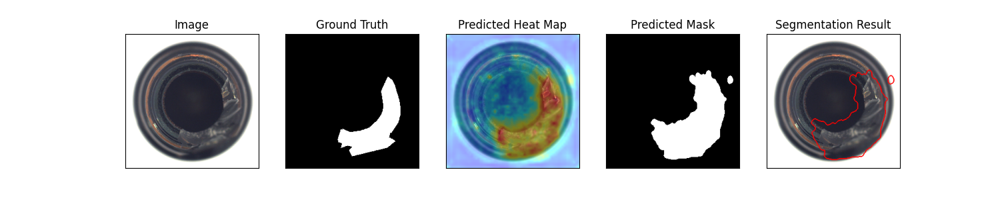
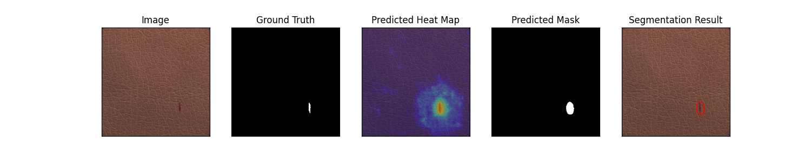
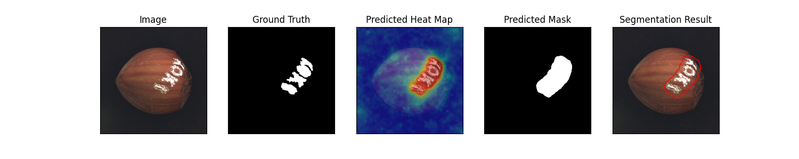

# FastFlow: Unsupervised Anomaly Detection and Localization via 2D Normalizing Flows

This is the implementation of the [FastFlow](https://arxiv.org/abs/2111.07677) paper. This code is developed inspired by [https://github.com/gathierry/FastFlow](https://github.com/gathierry/FastFlow).

Model Type: Segmentation

## Description

Unsupervised anomaly detection and localization is crucial to the practical application when collecting and labeling sufficient anomaly data is infeasible. Most existing representation-based approaches extract normal image features with a deep convolutional neural network and characterize the corresponding distribution through non-parametric distribution estimation methods. The anomaly score is calculated by measuring the distance between the feature of the test image and the estimated distribution. However, current methods can not effectively map image features to a tractable base distribution and ignore the relationship between local and global features which are important to identify anomalies. To this end, we propose FastFlow implemented with 2D normalizing flows and use it as the probability distribution estimator. Our FastFlow can be used as a plug-in module with arbitrary deep feature extractors such as ResNet and vision transformer for unsupervised anomaly detection and localization. In training phase, FastFlow learns to transform the input visual feature into a tractable distribution and obtains the likelihood to recognize anomalies in inference phase. Extensive experimental results on the MVTec AD dataset show that FastFlow surpasses previous state-of-the-art methods in terms of accuracy and inference efficiency with various backbone networks. Our approach achieves 99.4% AUC in anomaly detection with high inference efficiency.

## Architecture

## Usage

`python tools/train.py --model fastflow`

## Benchmark

All results gathered with seed `0`.

## [MVTec AD Dataset](https://www.mvtec.com/company/research/datasets/mvtec-ad)

### Image-Level AUC

|            | ResNet-18 | Wide ResNet50 | DeiT  | CaiT  |
| ---------- | --------- | ------------- | ----- | ----- |
| Bottle     | 1.000     | 1.000         | 0.905 |       |
| Cable      | 0.891     | 0.962         | 0.942 |       |
| Capsule    | 0.900     | 0.963         | 0.819 |       |
| Carpet     | 0.979     | 0.994         | 0.999 |       |
| Grid       | 0.988     | 1.000         | 0.991 |       |
| Hazelnut   | 0.846     | 0.994         | 0.900 |       |
| Leather    | 1.000     | 0.999         | 0.999 | 0.991 |
| Metal_nut  | 0.963     | 0.995         | 0.911 | 0.963 |
| Pill       | 0.916     | 0.942         | 0.910 | 0.916 |
| Screw      | 0.521     | 0.839         | 0.705 | 0.791 |
| Tile       | 0.744     | 1.000         | 0.993 | 0.998 |
| Toothbrush | 0.844     | 0.836         | 0.850 | 0.886 |
| Transistor | 0.916     | 0.979         |       | 0.983 |
| Wood       | 0.978     | 0.992         | 0.979 | 0.989 |
| Zipper     | 0.878     | 0.951         | 0.981 |       |
| Average    |           |               |       |       |

### Pixel-Level AUC

|            | ResNet-18 | Wide ResNet50 | DeiT  | CaiT  |
| ---------- | --------- | ------------- | ----- | ----- |
| Bottle     | 0.983     | 0.986         | 0.991 |       |
| Cable      | 0.954     | 0.972         | 0.973 |       |
| Capsule    | 0.985     | 0.990         | 0.979 |       |
| Carpet     | 0.983     | 0.991         | 0.991 |       |
| Grid       | 0.985     | 0.992         | 0.980 |       |
| Hazelnut   | 0.953     | 0.980         | 0.989 |       |
| Leather    | 0.996     | 0.996         | 0.995 | 0.996 |
| Metal_nut  | 0.972     | 0.988         | 0.978 | 0.973 |
| Pill       | 0.972     | 0.976         | 0.985 | 0.992 |
| Screw      | 0.920     | 0.966         | 0.945 | 0.979 |
| Tile       | 0.893     | 0.966         | 0.951 | 0.960 |
| Toothbrush | 0.979     | 0.980         | 0.985 | 0.992 |
| Transistor | 0.958     | 0.971         |       | 0.960 |
| Wood       | 0.956     | 0.941         | 0.952 | 0.954 |
| Zipper     | 0.965     | 0.985         | 0.978 |       |
| Average    |           |               |       |       |

### Image F1 Score
|            | ResNet-18 | Wide ResNet50 | DeiT  | CaiT  |
| ---------- | --------- | ------------- | ----- | ----- |
| Bottle     | 0.976     | 0.952         | 0.741 |       |
| Cable      | 0.851     | 0.918         | 0.848 |       |
| Capsule    | 0.937     | 0.952         | 0.905 |       |
| Carpet     | 0.955     | 0.983         | 0.994 |       |
| Grid       | 0.941     | 0.974         | 0.982 |       |
| Hazelnut   | 0.852     | 0.979         | 0.828 |       |
| Leather    | 0.995     | 0.974         | 0.995 | 0.963 |
| Metal_nut  | 0.925     | 0.969         | 0.899 | 0.916 |
| Pill       | 0.946     | 0.949         | 0.949 | 0.616 |
| Screw      | 0.853     | 0.893         | 0.868 | 0.979 |
| Tile       | 0.875     | 0.994         | 0.976 | 0.994 |
| Toothbrush | 0.875     | 0.870         | 0.833 | 0.833 |
| Transistor | 0.769     | 0.854         |       | 0.909 |
| Wood       | 0.983     | 0.968         | 0.944 | 0.967 |
| Zipper     | 0.921     | 0.975         | 0.958 |       |
| Average    |           |               |       |       |

### Pixel F1 Score
|            | ResNet-18 | Wide ResNet50 | DeiT  | CaiT  |
| ---------- | --------- | ------------- | ----- | ----- |
| Bottle     | 0.670     | 0.733         | 0.753 |       |
| Cable      | 0.547     | 0.564         | 0.487 |       |
| Capsule    | 0.472     | 0.490         | 0.399 |       |
| Carpet     | 0.573     | 0.598         | 0.586 |       |
| Grid       | 0.412     | 0.481         | 0.393 |       |
| Hazelnut   | 0.522     | 0.545         | 0.643 |       |
| Leather    | 0.560     | 0.576         | 0.504 | 0.516 |
| Metal_nut  | 0.728     | 0.754         | 0.766 | 0.617 |
| Pill       | 0.589     | 0.611         | 0.709 |       |
| Screw      | 0.061     | 0.660         | 0.269 | 0.370 |
| Tile       | 0.053     | 0.660         | 0.655 | 0.660 |
| Toothbrush | 0.479     | 0.481         | 0.524 | 0.535 |
| Transistor | 0.560     | 0.573         |       | 0.567 |
| Wood       | 0.557     | 0.488         | 0.614 | 0.572 |
| Zipper     | 0.492     | 0.621         | 0.522 |       |
| Average    |           |               |       |       |

### Sample Results

