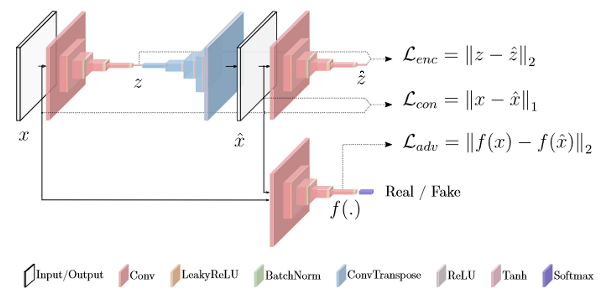

# GANomaly: Semi-Supervised Anomaly Detection via Adversarial Training

This is the implementation of the [GANomaly](https://arxiv.org/abs/1805.06725) paper.

Model Type: Classification

## Description

GANomaly uses the conditional GAN approach to train a Generator to produce images of the normal data. This Generator consists of an encoder-decoder-encoder architecture to generate the normal images. The distance between the latent vector $z$ between the first encoder-decoder and the output vector $\hat{z}$ is minimized during training.

The key idea here is that, during inference, when an anomalous image is passed through the first encoder the latent vector $z$ will not be able to capture the data correctly. This would leave to poor reconstruction $\hat{x}$ thus resulting in a very different $\hat{z}$. The difference between $z$ and $\hat{z}$ gives the anomaly score.

## Architecture

## Usage

`python tools/train.py --model ganomaly`

## Benchmark

All results gathered with seed `42`.

## [MVTec AD Dataset](https://www.mvtec.com/company/research/datasets/mvtec-ad)

### Image-Level AUC

|                |  Avg  | Carpet | Grid  | Leather | Tile  | Wood  | Bottle | Cable | Capsule | Hazelnut | Metal Nut | Pill  | Screw | Toothbrush | Transistor | Zipper |
| -------------- | :---: | :----: | :---: | :-----: | :---: | :---: | :----: | :---: | :-----: | :------: | :-------: | :---: | :---: | :--------: | :--------: | :----: |
|                | 0.421 | 0.203  | 0.404 | 0.413   | 0.408 | 0.744 | 0.251  | 0.457 |  0.682  | 0.537    |  0.270    | 0.472 | 0.231 | 0.372      |  0.440     | 0.434  |

### Image F1 Score

|                |  Avg  | Carpet | Grid  | Leather | Tile  | Wood  | Bottle | Cable | Capsule | Hazelnut | Metal Nut | Pill  | Screw | Toothbrush | Transistor | Zipper |
| -------------- | :---: | :----: | :---: | :-----: | :---: | :---: | :----: | :---: | :-----: | :------: | :-------: | :---: | :---: | :--------: | :--------: | :----: |
|                | 0.834 | 0.864  | 0.844 | 0.852   | 0.836 | 0.863 | 0.863  | 0.760 | 0.905   | 0.777    |  0.894    | 0.916 | 0.853 |  0.833     |  0.571     |  0.881 |
