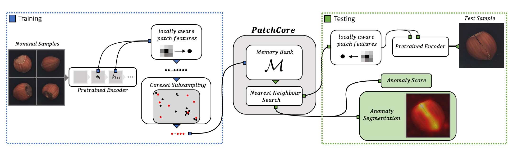
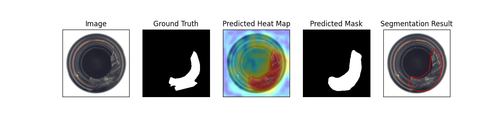
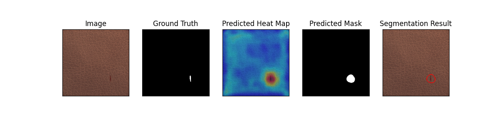
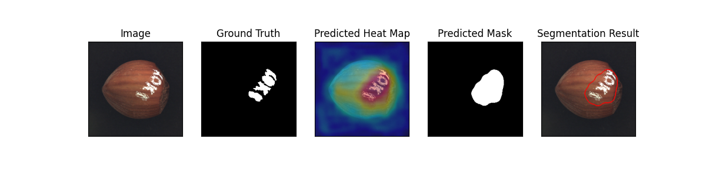

# PatchCore

This is the implementation of the [PatchCore](https://arxiv.org/pdf/2106.08265.pdf) paper.

Model Type: Segmentation

## Description

The PatchCore algorithm is based on the idea that an image can be classified as anomalous as soon as a single patch is anomalous. The input image is tiled. These tiles act as patches which are fed into the neural network. It consists of a single pre-trained network which is used to extract "mid" level features patches. The "mid" level here refers to the feature extraction layer of the neural network model. Lower level features are generally too broad and higher level features are specific to the dataset the model is trained on. The features extracted during training phase are stored in a memory bank of neighbourhood aware patch level features.

During inference this memory bank is coreset subsampled. Coreset subsampling generates a subset which best approximates the structure of the available set and allows for approximate solution finding. This subset helps reduce the search cost associated with nearest neighbour search. The anomaly score is taken as the maximum distance between the test patch in the test patch collection to each respective nearest neighbour.

## Architecture

## Usage

`python tools/train.py --model patchcore`

## Benchmark

All results gathered with seed `42`.

## [MVTec AD Dataset](https://www.mvtec.com/company/research/datasets/mvtec-ad)

### Image-Level AUC

|                |  Avg  | Carpet | Grid  | Leather | Tile  | Wood  | Bottle | Cable | Capsule | Hazelnut | Metal Nut | Pill  | Screw | Toothbrush | Transistor | Zipper |
| -------------- | :---: | :----: | :---: | :-----: | :---: | :---: | :----: | :---: | :-----: | :------: | :-------: | :---: | :---: | :--------: | :--------: | :----: |
| Wide ResNet-50 | 0.980 | 0.984  | 0.959 |  1.000  | 1.000 | 0.989 | 1.000  | 0.990 |  0.982  |  1.000   |   0.994   | 0.924 | 0.960 |   0.933    |   1.000    | 0.982  |
| ResNet-18      | 0.973 | 0.970  | 0.947 |  1.000  | 0.997 | 0.997 | 1.000  | 0.986 |  0.965  |  1.000   |   0.991   | 0.916 | 0.943 |   0.931    |   0.996    | 0.953  |

### Pixel-Level AUC

|                |  Avg  | Carpet | Grid  | Leather | Tile  | Wood  | Bottle | Cable | Capsule | Hazelnut | Metal Nut | Pill  | Screw | Toothbrush | Transistor | Zipper |
| -------------- | :---: | :----: | :---: | :-----: | :---: | :---: | :----: | :---: | :-----: | :------: | :-------: | :---: | :---: | :--------: | :--------: | :----: |
| Wide ResNet-50 | 0.980 | 0.988  | 0.968 |  0.991  | 0.961 | 0.934 | 0.984  | 0.988 |  0.988  |  0.987   |   0.989   | 0.980 | 0.989 |   0.988    |   0.981    | 0.983  |
| ResNet-18      | 0.976 | 0.986  | 0.955 |  0.990  | 0.943 | 0.933 | 0.981  | 0.984 |  0.986  |  0.986   |   0.986   | 0.974 | 0.991 |   0.988    |   0.974    | 0.983  |

### Image F1 Score

|                |  Avg  | Carpet | Grid  | Leather | Tile  | Wood  | Bottle | Cable | Capsule | Hazelnut | Metal Nut | Pill  | Screw | Toothbrush | Transistor | Zipper |
| -------------- | :---: | :----: | :---: | :-----: | :---: | :---: | :----: | :---: | :-----: | :------: | :-------: | :---: | :---: | :--------: | :--------: | :----: |
| Wide ResNet-50 | 0.976 | 0.971  | 0.974 |  1.000  | 1.000 | 0.967 | 1.000  | 0.968 |  0.982  |  1.000   |   0.984   | 0.940 | 0.943 |   0.938    |   1.000    | 0.979  |
| ResNet-18      | 0.970 | 0.949  | 0.946 |  1.000  | 0.982 | 0.992 | 1.000  | 0.978 |  0.969  |  1.000   |   0.989   | 0.940 | 0.932 |   0.935    |   0.974    | 0.967  |

### Sample Results

