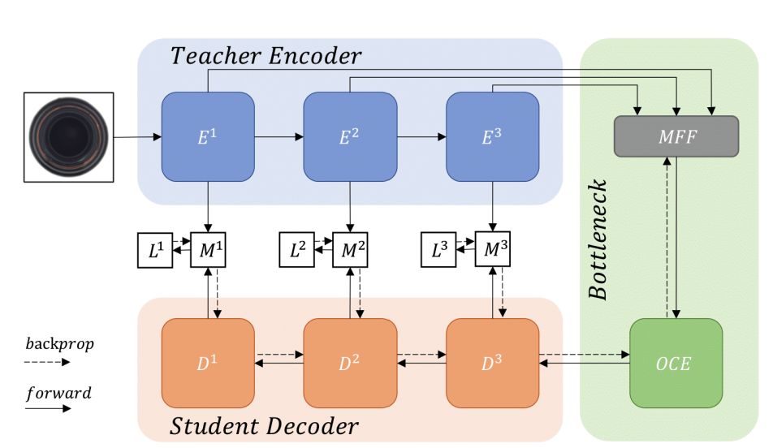
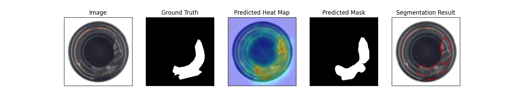
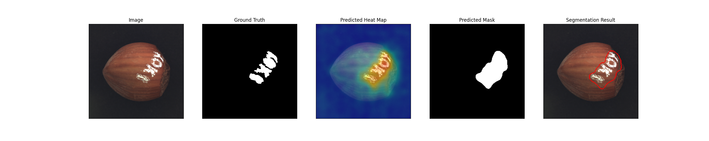

# Anomaly Detection via Reverse Distillation from One-Class Embedding

This is the implementation of the [Reverse Distillation](https://arxiv.org/pdf/2201.10703v2.pdf) paper.

Model Type: Segmentation

## Description

Reverse Distillation model consists of three networks. The first is a pre-trained feature extractor (E). The next two are the one-class bottleneck embedding (OCBE) and the student decoder network (D). The backbone E is a ResNet model pre-trained on ImageNet dataset. During the forward pass, features from three ResNet block are extracted. These features are encoded by concatenating the three feature maps using the multi-scale feature fusion block of OCBE and passed to the decoder D. The decoder network is symmetrical to the feature extractor but reversed. During training, outputs from these symmetrical blocks are forced to be similar to the corresponding feature extractor layers by using cosine distance as the loss metric.

During testing, a similar step is followed but this time the cosine distance between the feature maps is used to indicate the presence of anomalies. The distance maps from all the three layers are up-sampled to the image size and added (or multiplied) to produce the final feature map. Gaussian blur is applied to the output map to make it smoother. Finally, the anomaly map is generated by applying min-max normalization on the output map.

## Architecture

## Usage

`python tools/train.py --model reverse_distillation`

## Benchmark

All results gathered with seed `42`.

Note: Early Stopping (with patience 3) was enabled during training.

## [MVTec AD Dataset](https://www.mvtec.com/company/research/datasets/mvtec-ad)

### Image-Level AUC

|            | ResNet 18 | Wide ResNet 50 |
| :--------- | --------: | -------------: |
| Bottle     |     0.998 |          0.992 |
| Cable      |     0.982 |          0.583 |
| Capsule    |     0.864 |           0.78 |
| Carpet     |     0.996 |          0.539 |
| Grid       |     0.941 |          0.975 |
| Hazelnut   |     0.978 |          0.817 |
| Leather    |     0.878 |              1 |
| Metal_nut  |     0.999 |          0.929 |
| Pill       |     0.944 |          0.553 |
| Screw      |     0.778 |           0.86 |
| Tile       |     0.833 |          0.513 |
| Toothbrush |     0.967 |            0.7 |
| Transistor |     0.928 |          0.829 |
| Wood       |     0.989 |          0.993 |
| Zipper     |     0.968 |          0.787 |
| Average    |     0.936 |           0.79 |

### Pixel-Level AUC

|            | ResNet 18 | Wide ResNet 50 |
| :--------- | --------: | -------------: |
| Bottle     |     0.981 |          0.985 |
| Cable      |     0.965 |          0.794 |
| Capsule    |     0.983 |          0.986 |
| Carpet     |     0.989 |           0.99 |
| Grid       |     0.964 |           0.99 |
| Hazelnut   |     0.988 |          0.983 |
| Leather    |     0.984 |          0.995 |
| Metal_nut  |     0.971 |          0.979 |
| Pill       |     0.975 |          0.977 |
| Screw      |     0.987 |          0.989 |
| Tile       |     0.867 |          0.953 |
| Toothbrush |      0.99 |          0.979 |
| Transistor |      0.84 |          0.853 |
| Wood       |     0.939 |          0.958 |
| Zipper     |     0.988 |          0.959 |
| Average    |     0.961 |          0.958 |

### Image F1 Score

|            | ResNet 18 | Wide ResNet 50 |
| :--------- | --------: | -------------: |
| Bottle     |      0.95 |          0.959 |
| Cable      |     0.911 |           0.76 |
| Capsule    |     0.933 |          0.905 |
| Carpet     |     0.965 |          0.864 |
| Grid       |     0.964 |          0.945 |
| Hazelnut   |     0.909 |          0.901 |
| Leather    |     0.896 |          0.989 |
| Metal_nut  |     0.995 |          0.939 |
| Pill       |     0.931 |          0.922 |
| Screw      |      0.88 |          0.891 |
| Tile       |      0.88 |          0.836 |
| Toothbrush |     0.933 |          0.833 |
| Transistor |     0.769 |          0.744 |
| Wood       |     0.966 |          0.948 |
| Zipper     |     0.944 |          0.926 |
| Average    |     0.922 |          0.891 |

### Sample Results

