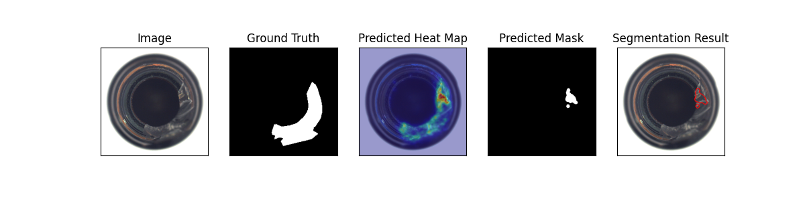
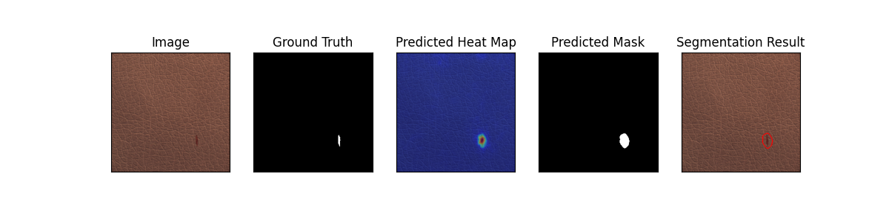
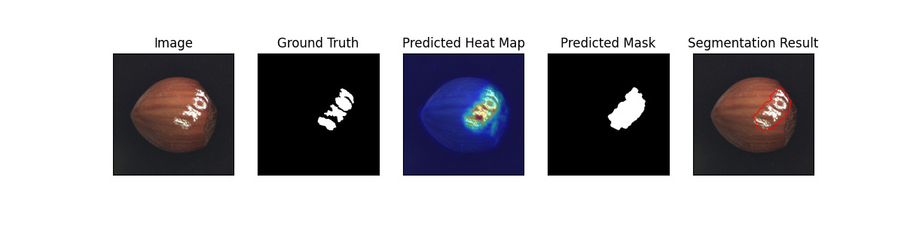

# Student-Teacher Feature Pyramid Matching for Unsupervised Anomaly Detection

This is the implementation of the [STFPM](https://arxiv.org/pdf/2103.04257.pdf) paper.

Model Type: Segmentation

## Description

STFPM algorithm which consists of a pre-trained teacher network and a student network with identical architecture. The student network learns the distribution of anomaly-free images by matching the features with the counterpart features in the teacher network. Multi-scale feature matching is used to enhance robustness. This hierarchical feature matching enables the student network to receive a mixture of multi-level knowledge from the feature pyramid thus allowing for anomaly detection of various sizes.

During inference, the feature pyramids of teacher and student networks are compared. Larger difference indicates a higher probability of anomaly occurrence.

## Architecture

## Usage

`python tools/train.py --model stfpm`

## Benchmark

All results gathered with seed `42`.

## [MVTec Dataset](https://www.mvtec.com/company/research/datasets/mvtec-ad)

### Image-Level AUC

|                |  Avg  | Carpet | Grid  | Leather | Tile  | Wood  | Bottle | Cable | Capsule | Hazelnut | Metal Nut | Pill  | Screw | Toothbrush | Transistor | Zipper |
| -------------- | :---: | :----: | :---: | :-----: | :---: | :---: | :----: | :---: | :-----: | :------: | :-------: | :---: | :---: | :--------: | :--------: | :----: |
| ResNet-18      | 0.893 | 0.954  | 0.982 |  0.989  | 0.949 | 0.961 | 0.979  | 0.838 |  0.759  |  0.999   |   0.956   | 0.705 | 0.835 |   0.997    |   0.853    | 0.645  |
| Wide ResNet-50 | 0.876 | 0.957  | 0.977 |  0.981  | 0.976 | 0.939 | 0.987  | 0.878 |  0.732  |  0.995   |   0.973   | 0.652 | 0.825 |    0.5     |   0.875    | 0.899  |

### Pixel-Level AUC

|                |  Avg  | Carpet | Grid  | Leather | Tile  | Wood  | Bottle | Cable | Capsule | Hazelnut | Metal Nut | Pill  | Screw | Toothbrush | Transistor | Zipper |
| -------------- | :---: | :----: | :---: | :-----: | :---: | :---: | :----: | :---: | :-----: | :------: | :-------: | :---: | :---: | :--------: | :--------: | :----: |
| ResNet-18      | 0.951 | 0.986  | 0.988 |  0.991  | 0.946 | 0.949 | 0.971  | 0.898 |  0.962  |  0.981   |   0.942   | 0.878 | 0.983 |   0.983    |   0.838    | 0.972  |
| Wide ResNet-50 | 0.903 | 0.987  | 0.989 |  0.980  | 0.966 | 0.956 | 0.966  | 0.913 |  0.956  |  0.974   |   0.961   | 0.946 | 0.988 |   0.178    |   0.807    | 0.980  |

### Image F1 Score

|                |  Avg  | Carpet | Grid  | Leather | Tile  | Wood  | Bottle | Cable | Capsule | Hazelnut | Metal Nut | Pill  | Screw | Toothbrush | Transistor | Zipper |
| -------------- | :---: | :----: | :---: | :-----: | :---: | :---: | :----: | :---: | :-----: | :------: | :-------: | :---: | :---: | :--------: | :--------: | :----: |
| ResNet-18      | 0.932 | 0.961  | 0.982 |  0.989  | 0.930 | 0.951 | 0.984  | 0.819 |  0.918  |  0.993   |   0.973   | 0.918 | 0.887 |   0.984    |   0.790    | 0.908  |
| Wide ResNet-50 | 0.926 | 0.973  | 0.973 |  0.974  | 0.965 | 0.929 | 0.976  | 0.853 |  0.920  |  0.972   |   0.974   | 0.922 | 0.884 |   0.833    |   0.815    | 0.931  |

### Sample Results

