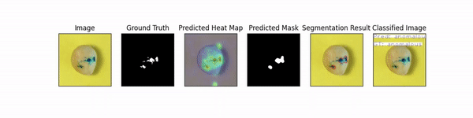
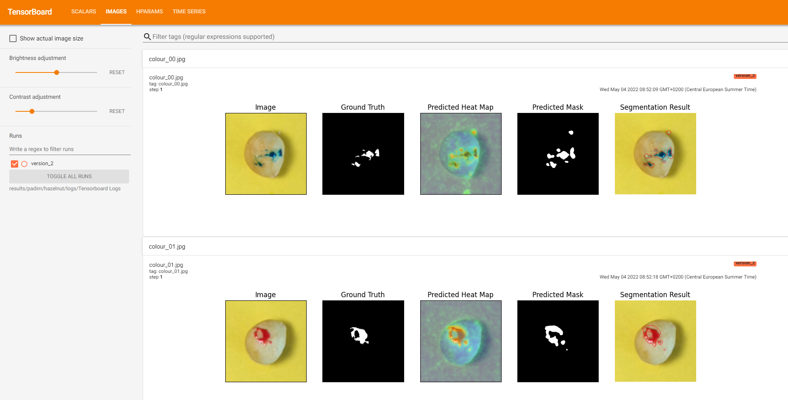

# How to Train Your Custom Dataset with Anomalib
<div align="center">

</div>

## Introducing Anomalib
In early 2022, a group of Intel AI Researchers released a ground-breaking Deep Learning Library named Anomalib. The library provides state-of-the art algorithms for Anomaly Detection on Image datasets. Anomalib serves to be a thorough end-to-end solution, offering many features to achieve the highest accuracy model while also providing inference deployment code with Intel’s OpenVino Toolkit.


## Why a dedicated library for Anomaly Detection?

Anomaly detection is the process of identifying anomalous items in a stream of input data. An example of a real-world anomaly detection problem is industrial defect detection, where the aim is to identify anomalous products in the output of a production line. In this type of application, anomalous items occur much less frequently than normal items, which makes it challenging to collect sufficient representative samples of the anomalous class. On top of that, the anomalous class is not well defined, and can contain a wide range of different defect types. These characteristics make it difficult to solve anomaly detection problems with classical, supervised methods. Instead, anomaly detection algorithms usually rely on unsupervised techniques to learn an implicit representation of normality, the normality model. During inference, new samples are compared against this normality model to determine if they belong to the normal or anomalous category.

Anomalib aims to collect the most recent deep-learning based anomaly detection algorithms with the purpose of providing a tool that makes it easy to benchmark different anomaly detection algorithms on public and custom datasets. Anomalib is continuously updated with the latest State-of-the-Art  algorithms, and contains several tools and interfaces that can be used to run experiments and create and test new algorithms.

## How to train a Custom dataset with Anomalib

Anomalib supports a number of datasets in various formats, including the state-of-the-art anomaly detection benchmarks such as MVTec AD and BeanTech. For those who would like to use the library on their custom datasets, anomalib also provides a "FolderDatasetModule" that can load datasets from a folder on a file system. The scope of this post will be to train anomalib models on custom datasets using the FolderDatasetModule.

### Step 1: Install Anomalib
#### Option - 1 : PyPI
Anomalib can be installed from PyPI via the following:

```bash
pip install anomalib
```

#### Option - 2: Editable Install
Alternatively, it is also possible to do editable install:
```bash
git clone https://github.com/openvinotoolkit/anomalib.git
cd anomalib
pip install -e .
```

### Step 2: Collect Your Custom Dataset
anomalib supports multiple image extensions such as `".jpg", ".jpeg", ".png", ".ppm", ".bmp", ".pgm", ".tif", ".tiff", and ".webp"`. A dataset could be collected from images that have any of these extensions.

### Step 3: Format your dataset
Depending on the use-case and collection, custom datasets could be of different formats, some of which are listed below:
-   A dataset with good and bad images.
-   A dataset with good and bad images as well as mask ground-truths for pixel-wise evaluation.
-   A dataset with good and bad images that is already split into training and testing sets.

Each of these use-cases is addressed by anomalib's  `FolderDataModule`. Let's focus on the first use-case as an example of end-to-end model training and inference.

Load your data to the following directory structure. Anomalib will use all images in the bad folder as part of the validation dataset and then randomly split the good images for training and validation.
```
example_dataset
├── bad
└── good
```

### Step 4: Modify Config File
A YAML configuration file is necessary to run training for Anomalib. The training configuration parameters are categorized into 4 sections: `dataset`, `model`, `project`, `trainer`.

To get Anomalib functionally working with a custom dataset, one only needs to change the `dataset` section of the configuration file. Below is an example of what the dataset parameters would look like for our `example_dataset` folder specified in [Step 2](#step-2-collect-your-data).

Let's choose [DFM algorithm](https://arxiv.org/abs/1909.11786), copy the sample config and modify the dataset section.
```bash
cp anomalib/models/dfm/config.yaml custom_dfm.yaml
```
```yaml
# Replace the dataset configs with the following.
dataset:
  name: example_dataset
  format: folder
  path: ./datasets/example_dataset
  normal: good # name of the folder containing normal images.
  abnormal: bad # name of the folder containing abnormal images.
  task: classification # classification or segmentation
  mask: null #optional
  extensions: null
  split_ratio: 0.2  # normal images ratio to create a test split
  seed: 0
  image_size: 256
  train_batch_size: 32
  test_batch_size: 32
  num_workers: 8
  transform_config: null
  create_validation_set: true
  tiling:
    apply: false
    tile_size: null
    stride: null
    remove_border_count: 0
    use_random_tiling: False
    random_tile_count: 16

model:
    name: dfm
    backbone: resnet18
    layer: layer3
    ...
```

### Step 5: Run training
As per the config file, move example_dataset to the datasets section in the main root directory of anomalib, and then run
```bash
python tools/train.py --config custom_dfm.yml
```

###  Step 6: Interpret Results
Anomalib will print out results of the trained model on the validation dataset. The printed metrics are dependent on the task mode chosen. The classification example provided in this tutorial prints out two scores: F1 and AUROC. The F1 score is a metric which values both the precision and recall, more information on its calculation can be found in this [blog](https://towardsdatascience.com/understanding-accuracy-recall-precision-f1-scores-and-confusion-matrices-561e0f5e328c).

**Additional Info**

Not only does Anomalib classify whether a part is defected or not, it can also be used to segment the defects as well. To do this, simply add a folder called “ground_truth” at the same directory level as the “good” and “bad” folders. This folder should contain masked images of the images in the “bad” folder, where white pixels denote where the defects are occurring. Populate the mask field in the config file with “ground_truth” and change the task to segmentation to see Anomalib segment defects.
```
example_dataset
├── bad
├── good
└── ground_truth
```

Here is an example of the generated results for a toy dataset containing Hazelnut with colour defects.

<div align="center">

</div>

## Logging and Experiment Management
While it is delightful to know how good your model performed on your preferred metric, it is even more exciting to see the predicted outputs. Anomalib provides a couple of ways to log and track experiments. These can be used individually or in a combination. As of the current release, you can save images to a local folder, or upload to weights and biases, or TensorBoard.

To select where you would like to save the images, change the `log_images_to` parameter in the `project` section in the config file.

For example, setting the following `log_images_to: ["local"]` will result in saving the images in the results folder as shown in the tree structure below:
```
results
└── dfm
    └── example_dataset
        ├── images
        │   ├── bad
        │   │   ├── 000.jpg
        │   │   ├── 001.jpg
        │   │   └── ...
        │   └── good
        │       ├── 000.jpg
        │       ├── 001.jpg
        │       └── ...
        └── weights
            └── model.ckpt
```

### Logging to Tensorboard and/or W&B
To use TensorBoard and/or  W&B logger, ensure that the logger parameter is set to `tensorboard`, `wandb` or `[tensorboard, wandb]` in the config file.

An example configuration for saving to TensorBoard  is shown in the figure below.
```yaml
project:
    seed: 42
    path: ./results
    log_images_to: [tensorboard]
    logger: tensorboard # options: [tensorboard, wandb, csv] or combinations.
```

<div align="center">

</div>

Similarly after setting logger to `wandb` you will see the images on your wandb project dashboard.

<div align="center">

</div>

### Hyper-Parameter Optimization
It is very rare to find a model which works out of the box for a particular dataset. However, fortunately, we support tools which work out of the box to help tune the models in Anomalib to your particular dataset. As of the publication of this blog post, Anomalib supports [weights and biases](https://wandb.ai/) for hyperparameter optimization. To get started have a look at `sweep.yaml` located at `tools/hpo`. It provides a sample of how one can define a hyperparameter sweep.

```yaml
observation_budget: 10
method: bayes
metric:
  name: pixel_AUROC
  goal: minimize
parameters:
  dataset:
    category: capsule
    image_size:
      values: [128, 256]
  model:
    backbone:
      values: [resnet18, wide_resnet50_2]
```

The observation_budget informs wandb about the number of experiments to run. The method section defines the kind of method to use for HPO search. For other available methods, have a look at [wandb documentation]. The parameters section contains dataset and model parameters. Any parameter defined here overrides the parameter in the original model configuration.

To run a sweep, you can just call,

```
python tools/hpo/wandb_sweep.py --model padim --config ./path_to_config.yaml --sweep_config tools/hpo/sweep.yaml"
```

In case model_config is not provided, the script looks at the default config location for that model. Note, you will need to have logged into a wandb account to use HPO search and view the results.

A sample run is visible in the screenshot below.
<div align="center">

</div>

## Benchmarking
To add to the suit of experiment tracking and optimization, anomalib also includes a benchmarking script for gathering results across different combinations of models, their parameters, and dataset categories. The model performance and throughputs are logged into a csv file that can also serve as a means to track model drift. Optionally, these same results can be logged to Weights and Biases and TensorBoard. A sample configuration file is shown in the screenshot below.

```yaml
seed: 42
compute_openvino: false
hardware:
  - cpu
  - gpu
writer:
  - wandb
  - tensorboard
grid_search:
  dataset:
    category:
      - bottle
      ...
    image_size: [224]
  model_name:
    - padim
    - patchcore
```

This configuration computes the throughput and performance metrics for cpu and gpu for four categories of the MVTec dataset for Padim and PatchCore models. The dataset can be configured in the respective model configuration files. By default, compute_openvino is set to False to support instances where OpenVINO requirements are not installed in the environment. Once installed, this flag can be set to True to get throughput on OpenVINO optimized models. The writer parameter is optional and can be set to writer: [] in case the user only requires a csv file without logging to each respective logger. It is a good practice to set a value of seed to ensure reproducibility across runs and thus, is set to a non-zero value by default.

Once a configuration is decided, benchmarking can easily be performed by calling

python tools/benchmarking/benchmark.py --config <relative/absolute path>/<paramfile>.yaml

A nice feature about the provided benchmarking script is that if the host system has multiple GPUs, the runs are parallelized over all the available GPUs for faster collection of result.

**Call to Action**

The Anomalib repository is actively maintained by some of Intel’s top researchers. Their goal is to provide the AI-community with top of the class performance and accuracy while also providing a great user-experience for developers. Checkout out the repo and install anomalib today!
