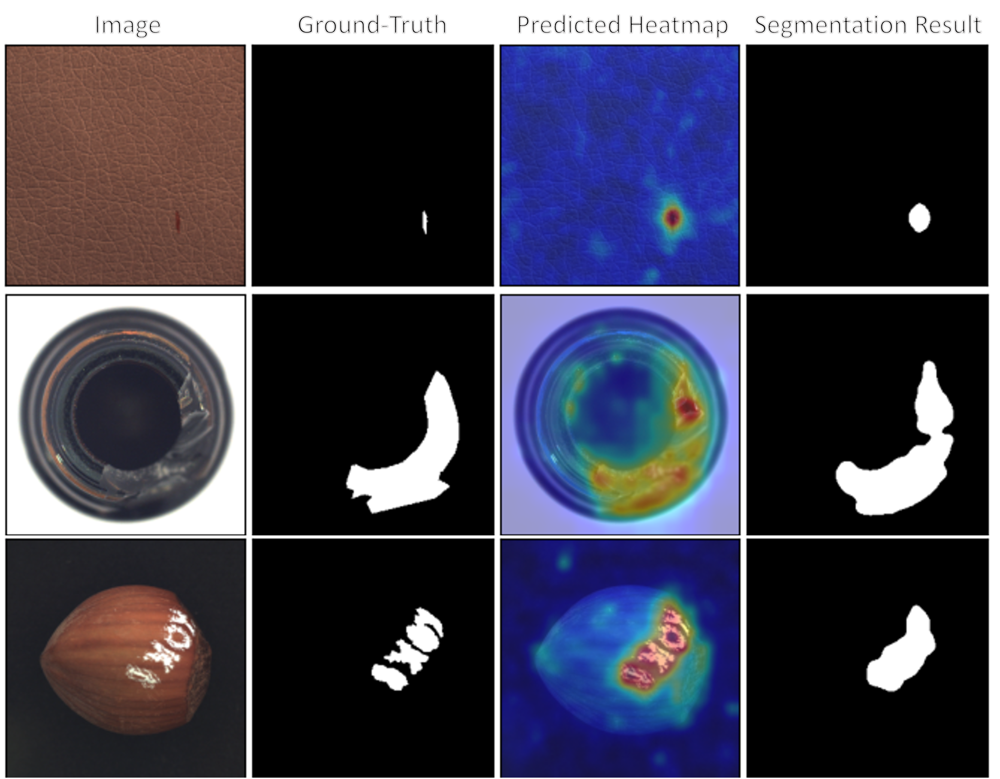

Welcome to Anomalib's documentation!
====================================

Anomalib is a deep learning library that aims to collect state-of-the-art anomaly detection algorithms for benchmarking on both public and private datasets. Anomalib provides several ready-to-use implementations of anomaly detection algorithms described in the recent literature, as well as a set of tools that facilitate the development and implementation of custom models. The library has a strong focus on image-based anomaly detection, where the goal of the algorithm is to identify anomalous images, or anomalous pixel regions within images in a dataset. Anomalib is constantly updated with new algorithms and training/inference extensions, so keep checking!

Supported Hardware
------------------
This repository as been tested on

- Ubuntu 20.04

- NVIDIA GeForce RTX 3090

.. toctree::
   :maxdepth: 1
   :name: start
   :caption: Getting Started

   guides/getting_started

.. toctree::
   :maxdepth: 1
   :caption: Models

   models

.. toctree::
   :maxdepth: 1
   :caption: Python API Reference

   api/index

.. toctree::
   :maxdepth: 1
   :caption: Tutorials

.. toctree::
   :maxdepth: 1
   :caption: Guides

   guides/developing_on_docker
   guides/structure_of_documentation
   guides/using_tox
   guides/using_pre_commit
   guides/inference
   guides/export
   guides/benchmarking
   guides/hyperparameter_optimization
   guides/logging

.. toctree::
   :maxdepth: 1
   :caption: Datasets

   data/hazelnut_toy

.. toctree::
   :maxdepth: 1
   :caption: Research

   research/benchmark
   research/papers
   research/citation

Indices and tables
==================

* :ref:`genindex`
* :ref:`modindex`
* :ref:`search`
