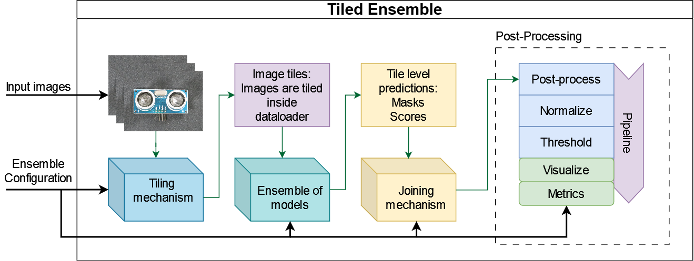

# Tiled ensemble

This guide will show you how to use **The Tiled Ensemble** method for anomaly detection. For more details, refer to the official [Paper](https://openaccess.thecvf.com/content/CVPR2024W/VAND/html/Rolih_Divide_and_Conquer_High-Resolution_Industrial_Anomaly_Detection_via_Memory_Efficient_CVPRW_2024_paper.html).

The tiled ensemble approach reduces memory consumption by dividing input images into a grid of tiles and training a dedicated model for each tile location.
It is compatible with any existing image anomaly detection model without the need for any modification of the underlying architecture.



```{note}
This feature is experimental and may not work as expected.
For any problems refer to [Issues](https://github.com/openvinotoolkit/anomalib/issues) and feel free to ask any question in [Discussions](https://github.com/openvinotoolkit/anomalib/discussions).
```

## Training

You can train a tiled ensemble using the training script located inside `tools/tiled_ensemble` directory:

```{code-block} bash

python tools/tiled_ensemble/train_ensemble.py \
    --config tools/tiled_ensemble/ens_config.yaml
```

By default, the Padim model is trained on **MVTec AD bottle** category using image size of 256x256, divided into non-overlapping 128x128 tiles.
You can modify these parameters in the [config file](#ensemble-configuration).

## Evaluation

After training, you can evaluate the tiled ensemble on test data using:

```{code-block} bash

python tools/tiled_ensemble/eval.py \
    --config tools/tiled_ensemble/ens_config.yaml \
    --root path_to_results_dir

```

Ensure that `root` points to the directory containing the training results, typically `results/padim/mvtec/bottle/runX`.

## Ensemble configuration

Tiled ensemble is configured using `ens_config.yaml` file in the `tools/tiled_ensemble` directory.
It contains general settings and tiled ensemble specific settings.

### General

General settings at the top of the config file are used to set up the random `seed`, `accelerator` (device) and the path to where results will be saved `default_root_dir`.

```{code-block} yaml
seed: 42
accelerator: "gpu"
default_root_dir: "results"
```

### Tiling

This section contains the following settings, used for image tiling:

```{code-block} yaml

tiling:
    tile_size: 256
    stride: 256
```

These settings determine the tile size and stride. Another important parameter is image_size from `data` section later in the config. It determines the original size of the image.

Input image is split into tiles, where each tile is of shape set by `tile_size` and tiles are taken with step set by `stride`.
For example: having image_size: 512, tile_size: 256, and stride: 256, results in 4 non-overlapping tile locations.

### Normalization and thresholding

Next up are the normalization and thresholding settings:

```{code-block} yaml
normalization_stage: image
thresholding:
  method: F1AdaptiveThreshold
  stage: image
```

- **Normalization**: Can be applied per each tile location separately (`tile` option), after combining prediction (`image` option), or skipped (`none` option).

- **Thresholding**: Can also be applied at different stages, but it is limited to `tile` and `image`. Another setting for thresholding is the method used. It can be specified as a string or by the class path.

### Data

The `data` section is used to configure the input `image_size` and other parameters for the dataset used.

```{code-block} yaml
data:
  class_path: anomalib.data.MVTec
  init_args:
    root: ./datasets/MVTec
    category: bottle
    train_batch_size: 32
    eval_batch_size: 32
    num_workers: 8
    task: segmentation
    transform: null
    train_transform: null
    eval_transform: null
    test_split_mode: from_dir
    test_split_ratio: 0.2
    val_split_mode: same_as_test
    val_split_ratio: 0.5
    image_size: [256, 256]
```

Refer to [Data](../../reference/data/image/index.md) for more details on parameters.

### SeamSmoothing

This section contains settings for `SeamSmoothing` block of pipeline:

```{code-block} yaml
SeamSmoothing:
  apply: True
  sigma: 2
  width: 0.1

```

SeamSmoothing job is responsible for smoothing of regions where tiles meet - called tile seams.

- **apply**: If True, smoothing will be applied.
- **sigma**: Controls the sigma of Gaussian filter used for smoothing.
- **width**: Sets the percentage of the region around the seam to be smoothed.

### TrainModels

The last section `TrainModels` contains the setup for model training:

```{code-block} yaml
TrainModels:
  model:
    class_path: Fastflow

  metrics:
    pixel: AUROC
    image: AUROC

  trainer:
    max_epochs: 500
    callbacks:
      - class_path: lightning.pytorch.callbacks.EarlyStopping
        init_args:
          patience: 42
          monitor: pixel_AUROC
          mode: max
```

- **Model**: Specifies the model used. Refer to [Models](../../reference/models/image/index.md) for more details on the model parameters.
- **Metrics**: Defines evaluation metrics for pixel and image level.
- **Trainer**: _optional_ parameters, used to control the training process. Refer to [Engine](../../reference/engine/index.md) for more details.
