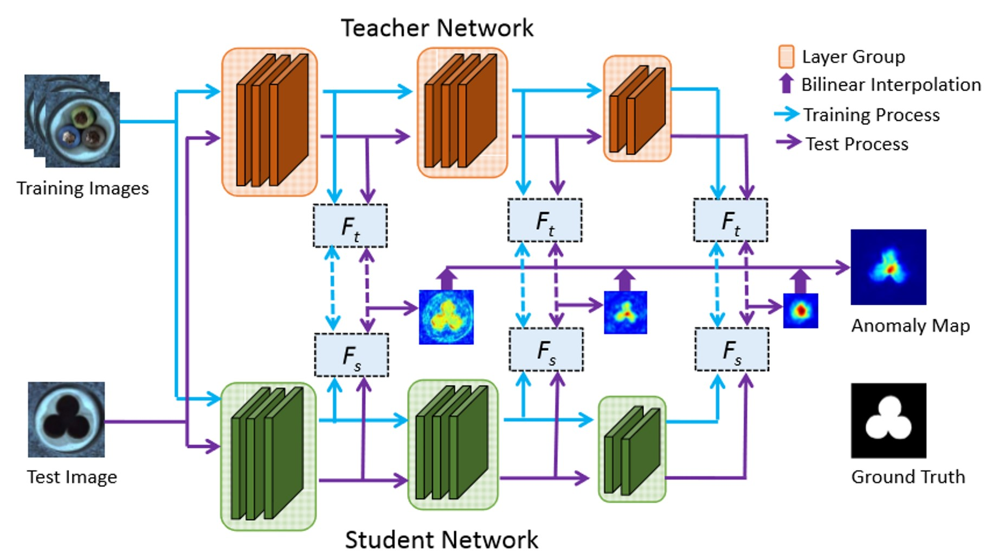

.. _available models:

Models Reference
=====================

Available Models
-----------------

Segmentation
*************

- `Padim`_
- `PatchCore`_
- `STFPM`_ (Supports OpenVINO)

Classification
***************

- `DFKDE`_
- `DFM`_

Loading Models
---------------

.. automodule:: anomalib.models
    :members:

.. currentmodule:: anomalib.models

DFKDE
-------

Model Type: Classification

Description
***********

Fast anomaly classification algorithm that consists of a deep feature extraction stage followed by anomaly classification stage consisting of PCA and Gaussian Kernel Density Estimation.

Feature Extraction
##################

Features are extracted by feeding the images through a ResNet50 backbone, which was pre-trained on ImageNet. The output of the penultimate layer (average pooling layer) of the network is used to obtain a semantic feature vector with a fixed length of 2048.

Anomaly Detection
#################

In the anomaly classification stage, the features are first reduced to the first 16 principal components. Gaussian Kernel Density is then used to obtain an estimate of the probability density of new examples, based on the collection of training features obtained during the training phase.

Usage
*****

.. code-block:: bash

    $ python tools/train.py --model dfkde

.. autosummary::
    :toctree: models
    :nosignatures:

    dfkde.model
    dfkde.normality_model

DFM
---

This is the implementation of `DFM <https://arxiv.org/pdf/1909.11786.pdf>`_ paper.

Model Type: Classification

Description
***********

Fast anomaly classification algorithm that consists of a deep feature extraction stage followed by anomaly classification stage consisting of PCA and class-conditional Gaussian Density Estimation.

Feature Extraction
##################

Features are extracted by feeding the images through a ResNet18 backbone, which was pre-trained on ImageNet. The output of the penultimate layer (average pooling layer) of the network is used to obtain a semantic feature vector with a fixed length of 2048.

Anomaly Detection
#################

In the anomaly classification stage, class-conditional PCA transformations and Gaussian Density models are learned. Two types of scores are calculated (i) Feature-reconstruction scores (norm of the difference between the high-dimensional pre-image of a reduced dimension feature and the original high-dimensional feature), and (ii) Negative log-likelihood under the learnt density models. Either of these scores can be used for anomaly detection.

Usage
*****

.. code-block:: bash

    $ python tools/train.py --model dfm

.. autosummary::
    :toctree: models
    :nosignatures:

    dfm.model
    dfm.dfm_model

Padim
------

This is the implementation of the `PaDiM <https://arxiv.org/pdf/2011.08785.pdf>`_ paper.

Model Type: Segmentation

Description
***********

PaDiM is a patch based algorithm. It relies on a pre-trained CNN feature extractor. The image is broken into patches and embeddings are extracted from each patch using different layers of the feature extractors. The activation vectors from different layers are concatenated to get embedding vectors carrying information from different semantic levels and resolutions. This helps encode fine grained and global contexts. However, since the generated embedding vectors may carry redundant information, dimensions are reduced using random selection. A multivariate gaussian distribution is generated for each patch embedding across the entire training batch. Thus, for each patch of the set of training images, we have a different multivariate gaussian distribution. These gaussian distributions are represented as a matrix of gaussian parameters.

During inference, Mahalanobis distance is used to score each patch position of the test image. It uses the inverse of the covariance matrix calculated for the patch during training. The matrix of Mahalanobis distances forms the anomaly map with higher scores indicating anomalous regions.

Architecture
************

.. image:: ./images/padim/architecture.jpg
    :alt: PaDiM Architecture

Usage
*****

.. code-block:: bash

    $ python tools/train.py --model padim

.. autosummary::
    :toctree: models
    :nosignatures:

    padim.model

PatchCore
----------

This is the implementation of the `PatchCore <https://arxiv.org/pdf/2106.08265.pdf>`_ paper.

Model Type: Segmentation

Description
***********

The PatchCore algorithm is based on the idea that an image can be classified as anomalous as soon as a single patch is anomalous. The input image is tiled. These tiles act as patches which are fed into the neural network. It consists of a single pre-trained network which is used to extract "mid" level features patches. The "mid" level here refers to the feature extraction layer of the neural network model. Lower level features are generally too broad and higher level features are specific to the dataset the model is trained on. The features extracted during training phase are stored in a memory bank of neighbourhood aware patch level features.

During inference this memory bank is coreset subsampled. Coreset subsampling generates a subset which best approximates the structure of the available set and allows for approximate solution finding. This subset helps reduce the search cost associated with nearest neighbour search. The anomaly score is taken as the maximum distance between the test patch in the test patch collection to each respective nearest neighbour.

Architecture
************

.. image:: ./images/patchcore/architecture.jpg
    :alt: PatchCore Architecture

Usage
*****

.. code-block:: bash

    $ python tools/train.py --model patchcore

.. autosummary::
    :toctree: models
    :nosignatures:

    patchcore.model
    patchcore.utils.sampling.k_center_greedy
    patchcore.utils.sampling.nearest_neighbors
    patchcore.utils.sampling.random_projection

STFPM
-------

This is the implementation of the `STFPM <https://arxiv.org/pdf/2103.04257.pdf>`_ paper.

Model Type: Segmentation

Description
***********

STFPM algorithm which consists of a pre-trained teacher network and a student network with identical architecture. The student network learns the distribution of anomaly-free images by matching the features with the counterpart features in the teacher network. Multi-scale feature matching is used to enhance robustness. This hierarchical feature matching enables the student network to receive a mixture of multi-level knowledge from the feature pyramid thus allowing for anomaly detection of various sizes.

During inference, the feature pyramids of teacher and student networks are compared. Larger difference indicates a higher probability of anomaly occurrence.

Architecture
************

Usage
*****

.. code-block:: bash

    $ python tools/train.py --model stfpm

.. autosummary::
    :toctree: models
    :nosignatures:

    stfpm.model
