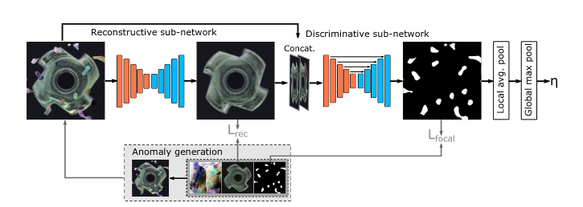

Draem
------

This is the implementation of the `DRAEM <https://arxiv.org/pdf/2108.07610v2.pdf>`_ paper.

Model Type: Segmentation

Description
***********

DRAEM is a reconstruction based algorithm that consists of a reconstructive subnetwork and a discriminative subnetwork. DRAEM is trained on simulated anomaly images, generated by augmenting normal input images from the training set with a random Perlin noise mask extracted from an unrelated source of image data. The reconstructive subnetwork is an autoencoder architecture that is trained to reconstruct the original input images from the augmented images. The reconstructive submodel is trained using a combination of L2 loss and Structural Similarity loss. The input of the discriminative subnetwork consists of the channel-wise concatenation of the (augmented) input image and the output of the reconstructive subnetwork. The output of the discriminative subnetwork is an anomaly map that contains the predicted anomaly scores for each pixel location. The discriminative subnetwork is trained using Focal Loss.

For optimal results, DRAEM requires specifying the path to a folder of image data that will be used as the source of the anomalous pixel regions in the simulated anomaly images. The path can be specified by editing the value of the model.anomaly_source_path parameter in the config.yaml file. The authors of the original paper recommend using the `DTD <https://www.robots.ox.ac.uk/~vgg/data/dtd/>`_ dataset as anomaly source.

Architecture
************

Usage
*****

.. code-block:: bash

    $ python tools/train.py --model draem

.. automodule:: anomalib.models.draem.torch_model
   :members:
   :undoc-members:
   :show-inheritance:

.. automodule:: anomalib.models.draem.lightning_model
   :members:
   :undoc-members:
   :show-inheritance:

.. automodule:: anomalib.models.draem.anomaly_map
   :members:
   :undoc-members:
   :show-inheritance:
