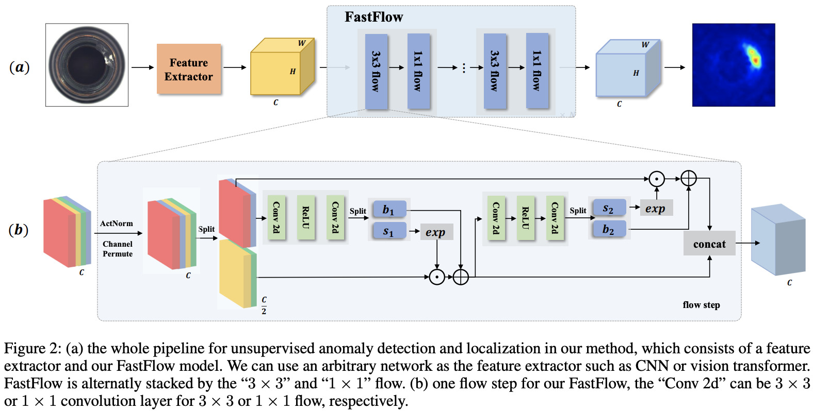

Fast-Flow
---------

This is the implementation of the `FastFlow <https://arxiv.org/abs/2111.07677>`_ paper.

Model Type: Segmentation

Description
***********

FastFlow is a two-dimensional normalizing flow-based probability distribution estimator. It can be used as a plug-in module with any deep feature extractor, such as ResNet and vision transformer, for unsupervised anomaly detection and localisation. In the training phase, FastFlow learns to transform the input visual feature into a tractable distribution, and in the inference phase, it assesses the likelihood of identifying anomalies.

Architecture
************

Usage
*****

.. code-block:: bash

    $ python tools/train.py --model fastflow

.. automodule:: anomalib.models.fastflow.torch_model
   :members:
   :undoc-members:
   :show-inheritance:

.. automodule:: anomalib.models.fastflow.lightning_model
   :members:
   :undoc-members:
   :show-inheritance:

.. automodule:: anomalib.models.fastflow.anomaly_map
   :members:
   :undoc-members:
   :show-inheritance:
