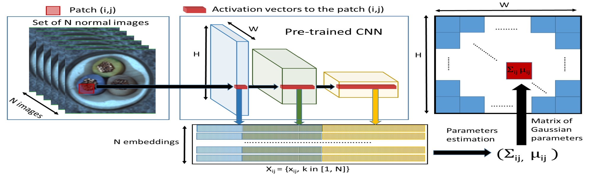

Padim
------

This is the implementation of the `PaDiM <https://arxiv.org/pdf/2011.08785.pdf>`_ paper.

Model Type: Segmentation

Description
***********

PaDiM is a patch based algorithm. It relies on a pre-trained CNN feature extractor. The image is broken into patches and embeddings are extracted from each patch using different layers of the feature extractors. The activation vectors from different layers are concatenated to get embedding vectors carrying information from different semantic levels and resolutions. This helps encode fine grained and global contexts. However, since the generated embedding vectors may carry redundant information, dimensions are reduced using random selection. A multivariate gaussian distribution is generated for each patch embedding across the entire training batch. Thus, for each patch of the set of training images, we have a different multivariate gaussian distribution. These gaussian distributions are represented as a matrix of gaussian parameters.

During inference, Mahalanobis distance is used to score each patch position of the test image. It uses the inverse of the covariance matrix calculated for the patch during training. The matrix of Mahalanobis distances forms the anomaly map with higher scores indicating anomalous regions.

Architecture
************

Usage
*****

.. code-block:: bash

    $ python tools/train.py --model padim

.. automodule:: anomalib.models.padim.torch_model
   :members:
   :undoc-members:
   :show-inheritance:

.. automodule:: anomalib.models.padim.lightning_model
   :members:
   :undoc-members:
   :show-inheritance:

.. automodule:: anomalib.models.padim.anomaly_map
   :members:
   :undoc-members:
   :show-inheritance:
