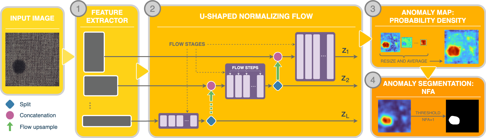

U-Flow
---------

This is the implementation of the `U-Flow <https://arxiv.org/abs/2211.12353>`_ paper.

Model Type: Segmentation

Description
***********

U-Flow is a U-Shaped normalizing flow-based probability distribution estimator.
The method consists of three phases.
(1) Multi-scale feature extraction: a rich multi-scale representation is obtained with MSCaiT, by combining pre-trained image Transformers acting at different image scales. It can also be used any other feature extractor, such as ResNet.
(2) U-shaped Normalizing Flow: by adapting the widely used U-like architecture to NFs, a fully invertible architecture is designed. This architecture is capable of merging the information from different scales while ensuring independence both intra- and inter-scales. To make it fully invertible, split and invertible up-sampling operations are used.
(3) Anomaly score and segmentation computation: besides generating the anomaly map based on the likelihood of test data, we also propose to adapt the a contrario framework to obtain an automatic threshold by controlling the allowed number of false alarms.

Architecture
************

Usage
*****

.. code-block:: bash

    $ python tools/train.py --model uflow

.. automodule:: anomalib.models.uflow.torch_model
   :members:
   :undoc-members:
   :show-inheritance:

.. automodule:: anomalib.models.uflow.lightning_model
   :members:
   :undoc-members:
   :show-inheritance:

.. automodule:: anomalib.models.uflow.anomaly_map
   :members:
   :undoc-members:
   :show-inheritance:
