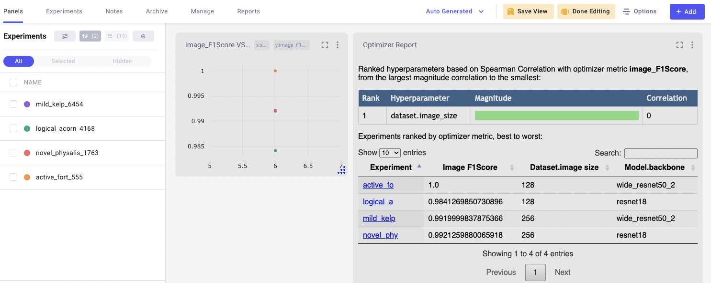
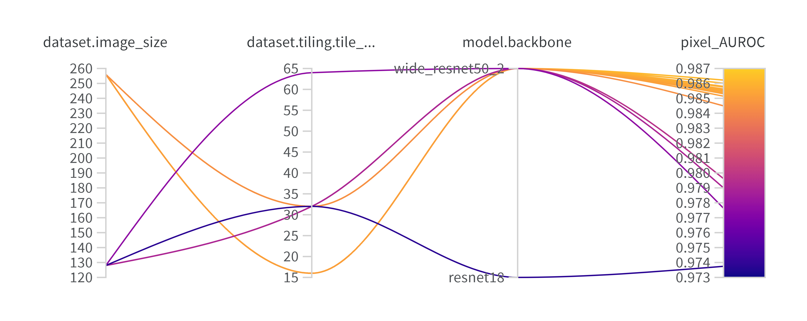

.. _hyperparameter_optimization

Hyperparameter Optimization
===========================

The default configuration for the models will not always work on a new dataset. Additionally, to increase performance, learning rate, optimizers, activation functions, etc. need to be tuned/selected. To make it easier to run such broad experiments that isolate the right combination of hyperparameters, Anomalib supports hyperparameter optimization using Comet or weights and biases.

YAML file
**********

A Sample configuration files for hyperparameter optimization with Comet is provided at ``tools/hpo/configs/comet.yaml`` and reproduced below:

.. code-block:: yaml

  algorithm: "bayes"
  spec:
    maxCombo: 10
    metric: "image_F1Score"
    objective: "maximize"
  parameters:
    dataset:
      category: capsule
      image_size:
        type: discrete
        values: [128, 256]
    model:
      backbone:
        type: categorical
        values: ["resnet18", "wide_resnet50_2"]

The maxCombo defines the total number of experiments to run. The algorithm is the optimization method to be used. The metric is the metric to be used to evaluate the performance of the model. The parameters are the hyperparameters to be optimized. For details on other possible configurations with Comet's Optimizer  , refer to the `Comet's <https://www.comet.com/docs/v2/api-and-sdk/python-sdk/introduction-optimizer/>`_ documentation.

A sample configuration file for hyperparameter optimization with Weights and Bias is provided at ``tools/hpo/configs/wandb.yaml`` and is reproduced below:

.. code-block:: yaml

  observation_budget: 10
  method: bayes
  metric:
    name: pixel_AUROC
    goal: maximize
  parameters:
    dataset:
      category: hazelnut
      image_size:
        values: [128, 256]
    model:
      backbone:
        values: [resnet18, wide_resnet50_2]

The observation budget defines the total number of experiments to run. The method is the optimization method to be used. The metric is the metric to be used to evaluate the performance of the model. The parameters are the hyperparameters to be optimized. For details on methods other than ``bayes`` and parameter values apart from list, refer the `Weights and Biases <https://docs.wandb.ai/guides/sweeps/quickstart>`_ documentation.

Everything under the ``parameters`` key (in both configuration formats) overrides the default values defined in the model configuration. In these examples, only the dataset and model parameters are overridden for the HPO search.

Running HPO
************

.. note::

  You will need to have logged into a Comet or wandb account to use HPO search and view the results.

To run the hyperparameter optimization, use the following command:

.. code-block:: bash

  python tools/hpo/sweep.py --model padim \
    --model_config ./path_to_config.yaml \
    --sweep_config tools/hpo/configs/comet.yaml

In case ``model_config`` is not provided, the script looks at the default config location for that model.

.. code-block:: bash

  python tools/hpo/sweep.py --sweep_config tools/hpo/configs/comet.yaml

Sample Output
**************

  Sample Comet sweep on Padim

  Sample wandb sweep on Padim
