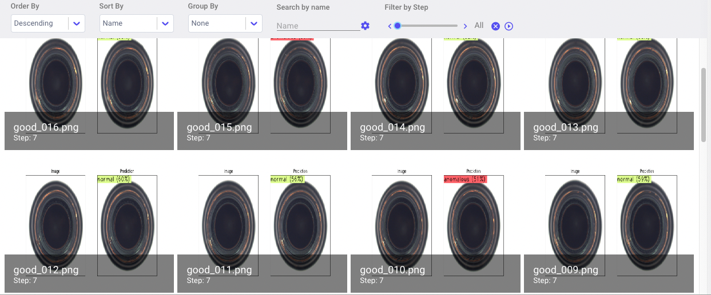
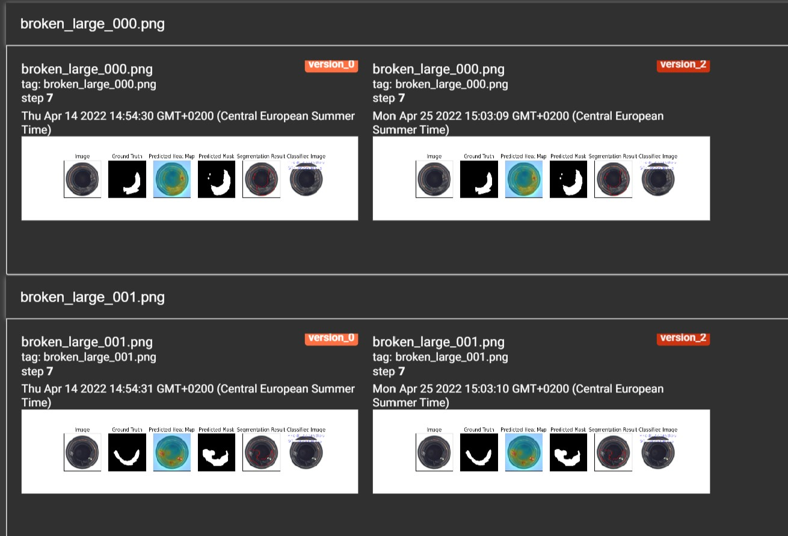
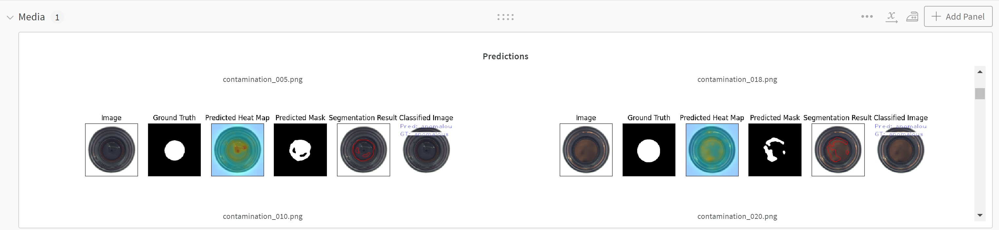
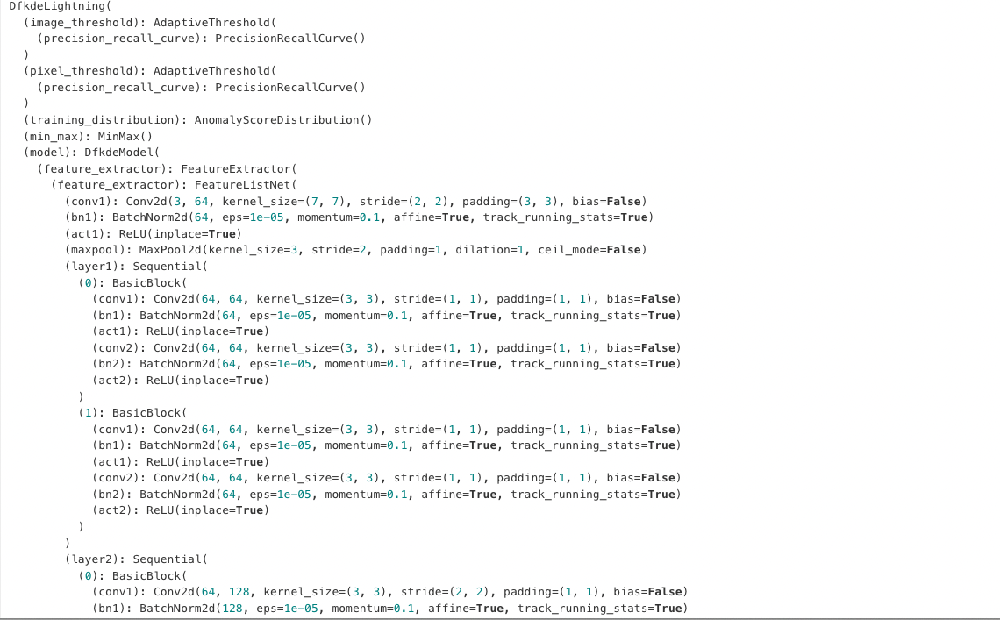
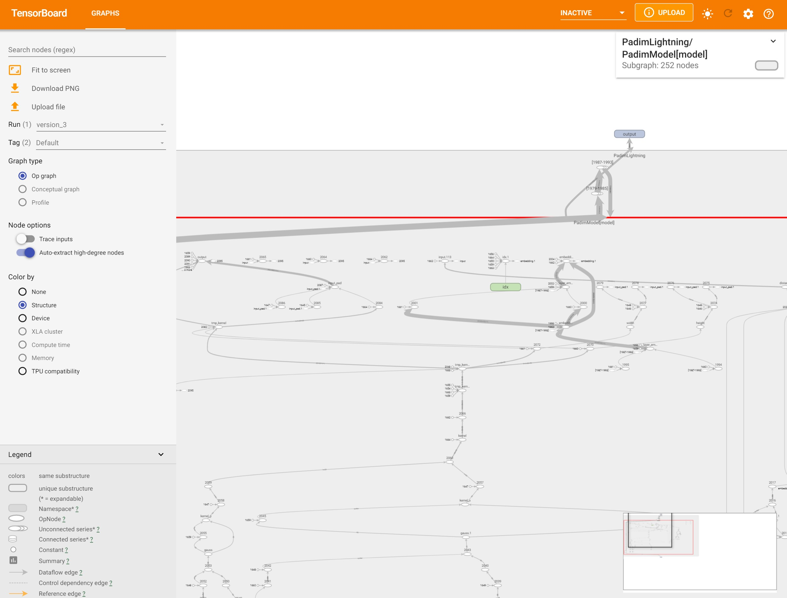

.. _logging:

Logging
========

Anomalib offers various mechanisms for logging metrics and predicted masks.

Enabling Logging
*****************

These can be enabled using the ``logger`` parameter in ``logging`` section of each model configuration file. The available options are ``comet``, ``tensorboard``, ``wandb`` and ``csv``.
For example, to log to TensorBoard:

.. code-block:: yaml

  logging:
      logger: "tensorboard"

You can also pass a list of loggers to enable multiple loggers. For example:

.. code-block:: yaml

  logging:
    logger: [comet, tensorboard, wandb]
    log_graph: false

Logging Images
**************

Anomalib allows you to save predictions to the file system by setting ``log_images: True`` in the visualization section . As of the current version, Anomalib also supports Comet, TensorBoard and Weights and Biases loggers for logging images. These loggers extend upon the base loggers by providing a common interface for logging images. You can access the required logger from ``trainer.loggers``. Then you can use ``logger.add_image`` method to log images. For a complete overview of this method refer to our `API documentation <https://openvinotoolkit.github.io/anomalib/api/anomalib/utils/loggers/index.html>`_.

.. code-block:: yaml

  visualization:
    show_images: False # show images on the screen
    save_images: False # save images to the file system
    log_images: True # log images to the available loggers (if any)
    image_save_path: null # path to which images will be saved
    mode: full # options: ["full", "simple"]

  logging:
    logger: [comet, tensorboard, wandb]
    log_graph: false

.. note::

  Logging images to Comet,TensorBoard and wandb won't work if you don't have ``logger: [comet, tensorboard, wandb]`` set as well. This ensures that the respective logger is passed to the trainer object.

  Comet Images in TensorBoard Dashboard

  Logged Images in TensorBoard Dashboard

  Logged Images in wandb Dashboard

Logging Other Artifacts
************************

To log other artifacts to the logger, you can directly access the logger object and call its respective method. Some of the examples mentioned here might require making changes to parts of anomalib outside the lightning model such as ``train.py``.

.. note::

  When accessing the base ``logger/logger.experiment`` object, refer to the documentation of the respective logger for the list of available methods.

Anomalib makes it easier to log your model graph to Comet, TensorBoard or Weights and Biases. Just set ``log_graph`` to True under ``logging`` parameter of the model configuration file.

.. code-block:: yaml

  logging:
    logger: [comet, tensorboard]
    log_graph: true

  Model Graph in Comet Dashboard

  Model Graph in TensorBoard Dashboard
