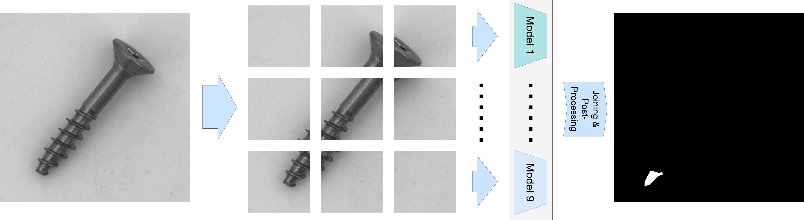

.. _tiled_ensemble:

Tiled ensemble
--------------
Anomalib provides tiled ensemble training. Images are split into tiles and separate model is trained for each tile location.

Training
========

Training of tiled ensemble can be done with training script using the following command:

.. code-block:: bash

    python tools/tiled_ensemble/train_ensemble.py \
        --ens_config tools/tiled_ensemble/ens_config.yaml 

By default padim model is trained on bottle category. Another model can be passed like in following example:

.. code-block:: bash

    python tools/tiled_ensemble/train_ensemble.py \
        --model fastflow \
        --ens_config tools/tiled_ensemble/ens_config.yaml 

Or using a path to config:

.. code-block:: bash

    python tools/tiled_ensemble/train_ensemble.py \
        --config src/anomalib/models/padim/config.yaml \
        --ens_config tools/tiled_ensemble/ens_config.yaml 

Evaluation
==========

To evaluate the trained tiled ensemble on test data, run the following script:

.. code-block:: bash

    python tools/tiled_ensemble/test_ensemble.py 
    --ens_config tools/tiled_ensemble/ens_config.yaml
    --weight_folder path_to_weights

In this case, path to weights should be the one inside results, where checkpoints are saved. Usually that is inside ``results/padim/mvtec/bottle/run/weights/lightning``.

Same as with training, ``--model`` or ``--config`` can be used.

Ensemble configuration
======================

Ensemble is configured using yaml file located inside ``tools/tiled_ensemble`` directory.

.. code-block:: yaml
    
    tiling:
        tile_size: 256
        stride: 256

Tiling section determines tile size and stride. Another important parameter is image_size from base model config file. It determines the original size of the image.
This image is then split into tiles, where each tile is of shape set by ``tile_size`` and tiles are taken with step set by ``stride``. 
Having image_size: 512, tile_size: 256, and stride: 256, results in 4 non-overlapping tile locations.

.. code-block:: yaml

    predictions:
        storage: direct # [direct, file_system, rescaled]
        rescale_factor: 0.5

Predictions section determines how ensemble predictions are stored. 
There are 3 options for storage:

* direct - predictions are stored in memory,
* file_system - predictions are stored to file system,
* rescaled - predictions are downscaled and stored in memory, where ``rescale_factor`` determines downscaling.

More details about storage can be found in ``prediction_data`` docstrings.

.. code-block:: yaml

    post_processing:
        normalization: final # [tile, final, none]
        smooth_joins:
            apply: True
            sigma: 2
            width: 0.1

Post processing section determines how normalization and smoothing of tile joins is handled.

Predictions can either be normalized by each tile location separately (``tile`` option), when all predictions are joined (``final`` option), or normalization can be skipped (with ``none`` option).

There is an option to apply tile join smoothing, where width determines percentage of region around the join where smoothing by Gaussian filter with given sigma will be applied.

.. code-block:: yaml

    metrics:
        image:
            - F1Score
            - AUROC
        pixel:
            - F1Score
            - AUROC
            - AUPRO
        threshold:
            stage: final # options: [tile, final]
            method: adaptive #options: [adaptive, manual]
            manual_image: null
            manual_pixel: null

Metrics section overrides the one in main config. It works in the same way but in this case thresholding stage is also determined. 
Thresholding is done during training tile wise in every case. But we can also re-do it once all the tiles are joined with ``final`` option.

.. code-block:: yaml

    visualization:
        show_images: False # show images on the screen
        save_images: True # save images to the file system
        image_save_path: null # path to which images will be saved
        mode: full # options: ["full", "simple"]

Visualization section overrides the one in main config and serves a function of setting up visualizer of final joined predictions.
