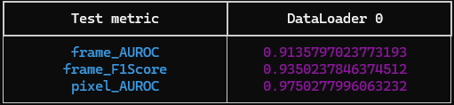

# [ICASSP 2025] FUVAS: Few-shot Unsupervised Video Anomaly Segmentation via Low-Rank Factorization of Spatio-Temporal Features

## 📝 Description

This folder contains the FUVAS video anomaly detection model which can support both transformer based backbone and CNN based backbone

## 💡 Examples

The following example shows how to use the FUVAS model to train on the ucsdped dataset.

<details>
<summary>Training the Fuvas model on UCSDped video dataset</summary>

```python
# Import the necessary modules
from anomalib.data import UCSDped
from anomalib.models import Fuvas
from anomalib.engine import Engine

# Load the avenue dataset, model and engine.
datamodule = UCSDped()
model = Fuvas()
engine = Engine()

# Train the model
engine.train(model, datamodule)
```
</details>

## Example running output



<section class="section" id="BibTeX">
  <div class="container is-max-desktop content">
    <h2 class="title">Citation</h2>
    <pre><code>@inproceedings{icassp2025fuvas,
  title={FUVAS: Few-shot Unsupervised Video Anomaly Segmentation via Low-Rank Factorization of Spatio-Temporal Features},
  author={Jiang, Jiaxiang and Ndiour, Ibrahima J and Subedar, Mahesh and Tickoo, Omesh},
  booktitle={ICASSP 2025-2025 IEEE International Conference on Acoustics, Speech and Signal Processing (ICASSP)},
  pages={1--5},
  year={2025},
  organization={IEEE}
}</code></pre>
  </div>
</section>

